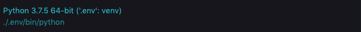

# O'Reilly Media, Inc | Head First Python, 2nd Edition #
## By: Paul Barry ##

I am on my journey to enhance my knowledge of Python. In this quest I am using [Head First Python ](https://www.oreilly.com/library/view/head-first-python/9781491919521/) book as one of the guiding lights. This repository will act as a place to store my notes and sample code from the book as it is said keeping notes while learning is a good practice.

My understanding of copyright laws is limited and hence if this process of making notes from books and publishing in Github in any way violates and such laws kindly contact me for removing the content. 

I am giving all necessary reference and credits for these notes.

## Table Of Content ##
1. [Chapter 01 : The Basics](DOCS/Chapter_01-The-Basics/ReadMe.md)
2. [Chapter 02 : List Data ](DOCS/Chapter_02-List-Data/ReadMe.md)
3. [Chapter 03 : Structured Data ](DOCS/Chapter_03-Structured-Data/ReadMe.md)
4. [Chapter 04 : Code Reuse ](DOCS/Chapter_04-Code-Reuse/ReadMe.md)
5. [Chapter 05 : Building a WebApp ](DOCS/Chapter_05-Building-A-WebApp/ReadMe.md)
6. [Chapter 06 : Storing and Manipulating Data ](DOCS/Chapter_06-Storing-And-Manipulating-Data/ReadMe.md)
7. [Chapter 07 : Using a Database ](DOCS/Chapter_07-Using-A-Database/ReadMe.md)
8. [Chapter 08 : A Little Bit of Class ](DOCS/Chapter_08-A-Little-Bit-Of-Class/ReadMe.md)
9. [Chapter 09 : The Context management protocol ](DOCS/Chapter_09-The-Context-Management-Protocol/ReadMe.md)
10. [Chapter 10 : Function Decorators ](DOCS/Chapter_10-Function-Decorators/ReadMe.md)
11. [Chapter 11 : Exception Handling ](DOCS/Chapter_11-Exception-Handling/ReadMe.md)
12. [Chapter 12 : A Little Bit of Threading ](DOCS/Chapter_12-A-Little-Bit-Of-Threading/ReadMe.md)
13. [Chapter 13 : Advanced Iteration ](DOCS/Chapter_13-Advanced-Iteration/ReadMe.md)


## Setup of a new Python Repository with Virtual environment and VS Code ##

The setup of a new python repository is very tiresome when you are learning python. I am trying to minimize these efforts.

I am using this setup.

* VS Code for Python Code
* Python 3 using virtual environment.
* Base Anaconda Python package.

### Assumptions ###

These are already installed in the system.

* Python
* PIP
* VS Code with python extension.
* Virtual Environment


### Step - 1 : Setup virtual environment ###
Virtual Environment is a tool provided in python, which helps in segregating different projects based on their dependency. `pip` provide this functionality of virtual environments.

The below command will run the `venv` module as a script and create a virtual environment and save it in a folder named `.env`
````
python -m venv .env
````

We can activate this environment by giving this command
````
source .env/bin/activate
````

### Step - 2 : Setup VS Code ###

Open the root folder of the code in VS Code. It will not detect the virtual environment as there is no file with python code. Create a file with `.py` extension. 

The moment we create the file, VS Code will ask about the python environment. Select the one which we created as `.env`, as shown below.



In my VS Code, I also have enabled the Black code formatter for Python and it is automatically triggered on saving the file using these settings.

````
"python.formatting.provider": "black",
"editor.formatOnSave": true,
````

VS Code will also ask to install a linting software, It is preferred to install pylint when asked by VS Code.

In short, we have to do these 3 steps to use VS Code for Python projects.

1. Create a Python File, and enable the required virtual environment.
2. Install a Python code formatter, 
3. Install a Python Linter.

### Step - 3 : Freeze Requirement ###
Once we have created a virtual environment, we might need to re-create the same environment again. Virtual environment gives a functionality to freeze the current environment.

````
.env/bin/pip freeze > requirements.txt
```` 

The `requirements.txt` contents are very simple. The names and version of the packages used.

````
appdirs==1.4.3
astroid==2.3.3
attrs==19.3.0
black==19.10b0
Click==7.0
isort==4.3.21
lazy-object-proxy==1.4.3
mccabe==0.6.1
pathspec==0.7.0
pylint==2.4.4
regex==2020.1.8
six==1.13.0
toml==0.10.0
typed-ast==1.4.1
wrapt==1.11.2
````

To recreate the same environment again copy the `requirements.txt` to new path and give this command after you created the virtual environment.

````
.env/bin/pip install -r requirements.txt
````

### Conclusion ###

Summing it up, we can safely say that the VS Code is that code editor for python and other languages which is highly extensible and yet very beginner friendly. It does not overwhelm a beginner with varied configuration. To enable Python in VS Code we just have to do these steps.

* Install Python Extension in VS Code.
* Enable Virtual environment for segregation of project dependencies. 
* Enable Code formatter like Black in VS Code, to write beautiful code.
* Enable PyLint in VS Code for efficient error detection of Python code.

### Reference ###
* [PIP documentation | pip freeze ](https://pip.pypa.io/en/stable/reference/pip_freeze/)
* [Install Python 3.6, Virtualenv, & Django on Mac](https://www.codingforentrepreneurs.com/blog/install-django-on-mac-or-linux)
* [Creating Python Virtual Environment in Windows and Linux ](https://www.geeksforgeeks.org/creating-python-virtual-environment-windows-linux/)
* [Linting Python in Visual Studio Code ](https://code.visualstudio.com/docs/python/linting)
* [Python in Visual Studio Code - May 2018 Release ](https://devblogs.microsoft.com/python/python-in-visual-studio-code-may-2018-release/)


